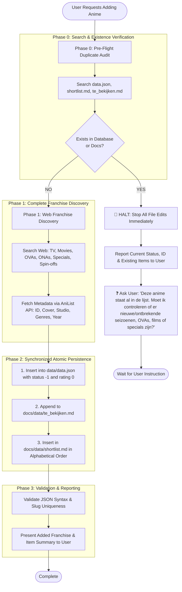

# Anime Adder Standard Operating Procedure (SOP)

This workflow defines the mandatory, step-by-step protocol for adding anime franchises and their associated releases (TV series, movies, OVAs, ONAs, specials) into the application ecosystem.

---

## 1. Visual Workflow Architecture



---

## 2. Pseudocode Execution Algorithm

```typescript
function processAddAnimeRequest(requestedAnimeName: string): void {
    // PHASE 0: PRE-FLIGHT AUDIT
    const normalizedQuery = normalizeString(requestedAnimeName);
    const existingEntry = findInDatabase({
        titles: [requestedAnimeName, getRomajiTitle(requestedAnimeName), getEnglishTitle(requestedAnimeName)],
        slugVariants: generatePossibleSlugs(requestedAnimeName),
        files: ["data/data.json", "docs/data/shortlist.md", "docs/data/te_bekijken.md"]
    });

    if (existingEntry) {
        // STRICT STOP POLICY
        abortFileModifications();
        logWarning(`Anime "${existingEntry.title}" already exists in the system (ID: ${existingEntry.id}).`);
        displayEntryDetails(existingEntry);
        askUser(
            "Deze anime staat al in de lijst. Moet ik controleren of er nieuwe of ontbrekende seizoenen, OVAs, films of specials zijn aangekondigd/uitgekomen?"
        );
        return; // HALT EXECUTION
    }

    // PHASE 1: DISCOVERY & METADATA
    const allReleases = searchWebForCompleteFranchise(requestedAnimeName); // TV, OVA, Movie, ONA, Special
    const anilistMetadata = fetchAniListMetadata(requestedAnimeName); // ONLY for new item addition

    // PHASE 2: ATOMIC PERSISTENCE
    const newAnimeObject = buildParentAnimeObject({
        id: generateCanonicalSlug(anilistMetadata.englishTitle || requestedAnimeName),
        anilistId: anilistMetadata.id,
        title: anilistMetadata.englishTitle,
        status: -1, // To Watch
        rating: 0,
        coverImage: anilistMetadata.coverImageMedium,
        studio: anilistMetadata.studio,
        year: anilistMetadata.year,
        genres: anilistMetadata.genres,
        items: buildItemsArray(allReleases)
    });

    appendEntryToDataJson("data/data.json", newAnimeObject);
    appendEntryToTeBekijken("docs/data/te_bekijken.md", newAnimeObject);
    insertAlphabeticallyInShortlist("docs/data/shortlist.md", newAnimeObject.title);

    // PHASE 3: VALIDATION
    verifyJsonIntegrity("data/data.json");
    reportSuccessToUser(newAnimeObject);
}
```

---

## 3. Detailed Execution Phases

### Phase 0: Pre-Flight Duplicate Audit (Mandatory First Step)
> [!CRITICAL]
> You must **NEVER** edit files or add entries before conducting a multi-key search across the workspace.

1. **Multi-Key Lookup**:
   * Search [data/data.json](file:///c:/Users/kenji/Documents/PROJECTS/RASCAL/data/data.json), [docs/data/shortlist.md](file:///c:/Users/kenji/Documents/PROJECTS/RASCAL/docs/data/shortlist.md), and [docs/data/te_bekijken.md](file:///c:/Users/kenji/Documents/PROJECTS/RASCAL/docs/data/te_bekijken.md).
   * Check all naming variants:
     * English Title (e.g., *"The Ryuo's Work is Never Done!"*)
     * Romaji / Japanese Title (e.g., *"Ryuuou no Oshigoto!"*)
     * Hyphenated Slugs (e.g., `the-ryuos-work-is-never-done`, `the-ryuo-s-work-is-never-done`, `ryuuou-no-oshigoto`)
     * AniList Media ID (if known).

2. **If Franchise Already Exists**:
   * **STOP IMMEDIATELY**: Do not touch any file.
   * **Present Existing Data**: Output the found title, ID, parent status, and existing item list.
   * **Inquire**: Ask the user:
     > *"Deze anime staat al in de lijst. Moet ik controleren of er nieuwe of ontbrekende seizoenen, OVAs, films of specials zijn aangekondigd/uitgekomen?"*

---

### Phase 1: Comprehensive Franchise Discovery
If and **only if** the anime does NOT exist:

1. **Deep Franchise Search**:
   * Conduct web searches across official and database sources (MAL, AniList, ANN) to identify **every** piece of media in the franchise:
     * Main TV Seasons
     * Movies / Theatrical Features
     * OVAs (Original Video Animations)
     * ONAs (Web Anime / Shorts)
     * Specials & Bonus Episodes
     * Spin-offs
   * *Rule*: Never assume you know all releases without verifying.

2. **Fetch Metadata via AniList API**:
   * Fetch official English title, Romaji title, AniList ID, cover image URL (`coverImage.medium` / `large`), primary studio, release year, genres, and start date.
   * *Rule*: AniList API is strictly reserved for metadata retrieval of new items.

---

### Phase 2: Synchronized Persistence

#### 1. Database Object: `data/data.json`
Construct the parent entry and its `items` array following strict typing:

```json
{
    "id": "canonical-lowercase-slug",
    "anilistId": 12345,
    "title": "Official English Title",
    "status": -1,
    "rating": 0,
    "releaseDate": "YYYY-MM-DD",
    "coverImage": "https://s4.anilist.co/file/anilistcdn/media/anime/cover/medium/...",
    "studio": "Main Studio Name",
    "year": 2024,
    "genres": ["Genre1", "Genre2"],
    "watchRank": null,
    "items": [
        {
            "id": "canonical-item-slug",
            "title": "Season / Item Title",
            "status": -1,
            "type": "SERIE",
            "rating": 0,
            "watchedEpisodes": [],
            "episodesCount": 12
        }
    ]
}
```

##### Allowed Enum Values & Status Matrix
* **Item Types**: `SERIE`, `MOVIE`, `OVA`, `SPECIAL`, `ONA`, `SPIN-OFF`.
* **Status Codes**:

| Code | Status Label | Allowed On | Description |
| :---: | :--- | :---: | :--- |
| **`-1`** | **To Watch** | Parent & Item | Planned to watch (default initial state). |
| **`0`** | **Watching** | Parent & Item | Active watch progress in `watchedEpisodes`. |
| **`1`** | **Watched** | Parent & Item | Completely finished. |
| **`2`** | **Upcoming** | **Items Only** | Announced / scheduled, not yet released. |
| **`3`** | **Airing** | **Items Only** | Currently broadcasting episodes. |

> [!CAUTION]
> - Never set a parent anime's `status` to `2` or `3`.
> - Never use strings like `"New"` for data status.

#### 2. Documentation: `docs/data/te_bekijken.md`
Append the franchise and its unchecked items:
```markdown
## Official English Title
- [ ] Official English Title Season 1 (TV Series - 12 eps)
- [ ] Item Title (OVA - 1 eps)
- [ ] Movie Title (Movie)
```

#### 3. Shortlist: `docs/data/shortlist.md`
Insert the exact English title into the list in **strict alphabetical order**.

---

### Phase 3: Integrity Validation
1. **JSON Syntax**: Execute a JSON parse check to ensure `data/data.json` remains strictly valid.
2. **Title Alignment**: Confirm that `data.json` `title` exactly matches the `## Header` in `te_bekijken.md` and the line in `shortlist.md`.
3. **Report to User**: Summarize the additions and prompt the user to verify in the application UI (do not use browser subagents for UI verification).
