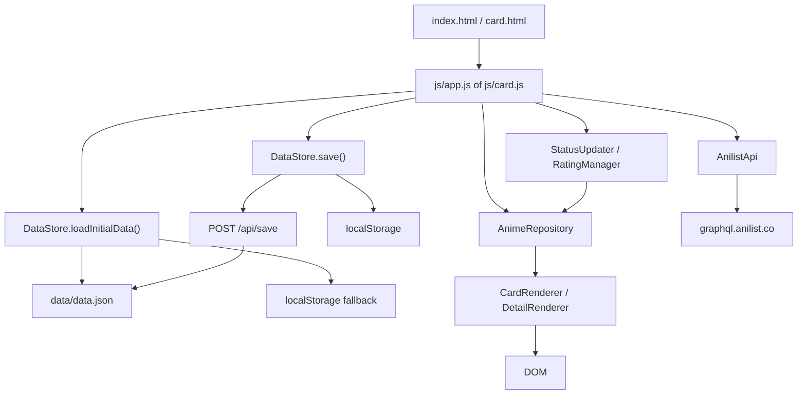

# RASCAL Anime Tracker

RASCAL is een lokale anime-tracker voor het beheren van een persoonlijke lijst, met statusfilters, sortering, zoekfunctie, grid/list-weergave, detailpagina per titel, episode-progressie, scores en optionele AniList-hydratatie voor poster- en bannerafbeeldingen.

De app is bedoeld als een compacte, offline-first bibliotheek voor anime-franchises en hun subitems zoals seizoenen, films, OVA's, specials en andere releases.

## Wat de app precies doet

- Houdt een lijst bij van anime-groepen.
- Laat per anime een globale status zien.
- Laat per subitem binnen die anime een afzonderlijke status en episode-progressie zien.
- Biedt een overzichtspagina met cards.
- Biedt een detailpagina met een sidebar, een accordeonlijst en episode-checkboxes.
- Laat scores toe op schaal 0 tot 10.
- Slaat wijzigingen lokaal op in `localStorage`.
- Probeert wijzigingen ook terug te schrijven naar `data/data.json` via een lokale Flask-server.
- Kan een JSON-backup downloaden.
- Kan ontbrekende coverart, banners en episode-aantallen ophalen via AniList.

## Kernidee

De app werkt met twee lagen:

1. Een **overzichtsniveau** voor de franchise als geheel.
2. Een **itemniveau** voor individuele seizoenen, films, OVA's, specials of andere releases binnen die franchise.

Dat betekent dat een anime bijvoorbeeld `Bekeken` kan zijn terwijl een later seizoen `Bezig` of `Nieuw` is. De detailpagina vertaalt die combinatie terug naar het juiste globale statussymbool.

## Starten van de app

Gebruik de Python startserver:

```bash
python START_UP.py
```

De server:

- serveert `index.html` en de overige statische bestanden;
- opent automatisch de browser op `http://localhost:5000`;
- accepteert writes naar `POST /api/save`;
- schrijft die data terug naar `data/data.json`.

### Waarom een server nodig is

De frontend laadt data met `fetch('data/data.json')`. Als je de HTML direct opent via `file://`, dan werkt die fetch meestal niet zoals bedoeld. De lokale Flask-server is daarom de normale manier om de app te gebruiken.

## Bestandsoverzicht

### Root

- `index.html`
  - Overzichtspagina.
  - Bevat header, filters, sortering, view toggles, counters en de kaartcontainer.
- `card.html`
  - Detailpagina voor een enkele anime.
  - Bevat de terugknop, de detailcontainer en het gedeelde ratingmodal.
- `START_UP.py`
  - Lokale Flask-server.
  - Serveert de app en schrijft JSON-updates terug naar schijf.

### CSS

- `css/styles.css`
  - Alle layout-, component- en thema-opmaak.
  - Bevat de styling voor:
    - header
    - toolbar
    - cards
    - detail layout
    - accordions
    - modals
    - statusdropdowns
    - rating badges
    - responsive gedrag

### JavaScript

- `js/app.js`
  - Entry point van de overzichtspagina.
  - Laadt data, initialiseert filters, sortering, zoekfunctie, view toggles, thema en downloadknop.
  - Start achtergrond-AniList-hydratatie.
- `js/card.js`
  - Entry point van de detailpagina.
  - Leest `?id=...` uit de URL en rendert de juiste anime.
  - Verwerkt itemstatus, globale status, episode toggles en ratingmodal.

### Domeinlaag

- `js/domein/Anime.js`
  - Model voor een anime-groep.
- `js/domein/AnimeItem.js`
  - Model voor een item binnen een anime-groep.
- `js/domein/AnimeRepository.js`
  - In-memory collectie en filter/sort helpers.
- `js/domein/DataStore.js`
  - Load/save/export laag.
- `js/domein/CardRenderer.js`
  - Rendert de cards in het overzicht.
- `js/domein/DetailRenderer.js`
  - Rendert de detailpagina.
- `js/domein/StatusUpdater.js`
  - Houdt globale status, itemstatus en episode-progressie consistent.
- `js/domein/RatingManager.js`
  - Koppelt scores aan CSS-klassen en schrijft ratings weg naar het model.
- `js/domein/SearchManager.js`
  - Koppelt het zoekveld aan de renderflow.
- `js/domein/AnilistApi.js`
  - Minimal GraphQL-client voor AniList.

## Dataflow



## Overzichtspagina

De overzichtspagina is de startpagina van de app. Ze toont alle animegroepen als cards.

### Bovenbalk

De header bevat:

- het RASCAL-logo;
- een zoekveld;
- een AniList-knop;
- een downloadknop;
- een themeknop.

### Toolbar

Onder de header staat de toolbar met:

- statusfilters;
- sorteerkeuze;
- grid/list-toggle;
- gridgrootteknoppen;
- itemcounter.

#### Statusfilters

De filterknoppen gebruiken de volgende waarden:

- `all`
  - toont alles.
- `2`
  - toont `Nieuw`.
- `-1`
  - toont `Te Bekijken`.
- `0`
  - toont `Bezig`.
- `1`
  - toont `Bekeken`.

#### Sortering

De sortering wordt toegepast nadat de filter en zoekquery zijn verwerkt.

Beschikbare sorteringen:

- `default`
- `title-asc`
- `title-desc`
- `rating-desc`
- `rating-asc`
- `status`

#### Weergave

De app ondersteunt twee hoofdweergaven:

- `grid`
  - visueel card-overzicht;
- `list`
  - compacte lijstweergave.

In gridmodus zijn er drie dichtheden:

- `size-s`
- `size-m`
- `size-l`

De gekozen modus en grootte worden in `localStorage` bewaard.

### Cards

Elke card toont:

- statusicoon;
- poster of fallback-tegels;
- titel;
- itemaantal;
- ratingbadge;
- klikbare navigatie naar de detailpagina.

De ratingbadge opent een ratingmodal. De card zelf navigeert naar `card.html?id=<anime-id>`.

## Detailpagina

De detailpagina toont precies een animegroep.

### Sidebar

De sidebar bevat:

- poster of fallback;
- titel;
- ratingbadge;
- globale statusdropdown.

### Main content

De hoofdsectie bevat een lijst met items zoals:

- seizoenen;
- films;
- OVA's;
- specials;
- andere releases.

Elk item heeft:

- een typebadge;
- een titel;
- een statusdropdown;
- een playknop die naar een zoekresultaat op Anikai gaat;
- een episode-accordionset.

### Accordions

Een item kan opengeklapt worden om episode-checkboxes te tonen. De checkboxen sturen terug naar `StatusUpdater.toggleEpisode()`.

### Ratingmodal

De detailpagina gebruikt hetzelfde ratingmodal als de overzichtspagina. Dat zorgt voor een consistente scoreflow.

## Statusmodel

De app gebruikt vier globale statussen:

- `-1`
  - `Te Bekijken`
- `0`
  - `Bezig`
- `1`
  - `Bekeken`
- `2`
  - `Nieuw`

### Betekenis op itemniveau

Op itemniveau betekenen die waarden ongeveer hetzelfde, maar daar kunnen ze ook puur de staat van een seizoen of film beschrijven.

### Sync-regels

`StatusUpdater` zorgt ervoor dat de relatie tussen itemstatussen en globale status logisch blijft:

- als alles bekeken is, gaat de anime naar `Bekeken`;
- als er een mix is van bekeken en te bekijken, of als een item expliciet bezig is, wordt de anime `Bezig`;
- als er een nieuw seizoen is zonder mixed catch-up-situatie, wordt de anime `Nieuw`;
- anders valt de anime terug naar `Te Bekijken`.

### Episode-logica

Episode-checkboxes sturen de itemstatus automatisch mee:

- geen episodes gemarkeerd -> `Te Bekijken`;
- gedeeltelijk gemarkeerd -> `Bezig`;
- alle episodes gemarkeerd -> `Bekeken`.

## Ratingmodel

Scores lopen van `0` tot `10`.

### Badgekleuren

`RatingManager` koppelt scorebereiken aan CSS-klassen:

- `unrated`
  - geen score;
- `r-cinema`
  - zeer hoge score;
- `r-awesome`
  - zeer sterke score;
- `r-great`
  - goede score;
- `r-good`
  - degelijke score;
- `r-regular`
  - middelmatige score;
- `r-bad`
  - lage score;
- `r-garbage`
  - erg lage score.

### Card-glow

Hoge of lage ratings kunnen ook een extra glow op de card geven via:

- `glow-gold`
- `glow-red`

## Opslag

De app heeft drie opslaglagen in volgorde van praktisch gebruik:

1. `data/data.json`
2. `localStorage`
3. een downloadbare backup via de browser

### Laden

`DataStore.loadInitialData()` probeert eerst:

- het JSON-bestand;
- daarna `localStorage`;
- daarna een lege lijst.

### Opslaan

`DataStore.save()`:

- schrijft naar `localStorage` onder `rascal_anime_data`;
- probeert daarna `POST /api/save`.

### Backup

`DataStore.triggerBackup()` genereert een downloadbare `data.json` met de huidige repository-inhoud.

## AniList-hydratatie

De app kan metadata aanvullen via AniList:

- coverafbeeldingen;
- banners;
- episode-aantallen.

### Wanneer gebeurt dat?

- Bij de overzichtspagina worden ontbrekende covers in batches opgehaald.
- Op de detailpagina wordt voor de geselecteerde anime gericht een enkele fetch gedaan.

### Waarom batchen?

De achtergrond-hydratatie gebruikt batches om API-verkeer te spreiden en de kans op rate-limit-problemen te verkleinen.

### Wanneer wordt AniList gebruikt?

Als een anime:

- een `anilistId` heeft, wordt die direct gebruikt;
- geen `anilistId` heeft, wordt gezocht op titel.

## Belangrijke modelvelden

### Anime

- `id`
  - stabiele sleutel voor routing en opslag.
- `anilistId`
  - optionele koppeling met AniList.
- `title`
  - hoofdnaam van de animegroep.
- `status`
  - globale status van de groep.
- `rating`
  - persoonlijke score.
- `releaseDate`
  - optionele releasedatum.
- `coverImage`
  - posterafbeelding.
- `bannerImage`
  - bannerafbeelding.
- `items`
  - lijst met subitems.

### AnimeItem

- `id`
  - stabiele sleutel binnen de groep.
- `title`
  - seizoen-, film- of specialtitel.
- `type`
  - bijvoorbeeld `SERIE`, `MOVIE`, `OVA`, `SPECIAL`, `ONA`, `SPIN-OFF`.
- `status`
  - itemstatus.
- `episodesCount`
  - totaal aantal episodes of een synthetische waarde voor films/specials.
- `watchedEpisodes`
  - lijst met gemarkeerde episode-nummers.

## Hoe de pagina's samenwerken

### Overzicht naar detail

`CardRenderer.createCard()` zet een klik op de card om in:

```text
card.html?id=<anime-id>
```

### Detail naar opslag

Elke wijziging in:

- status;
- rating;
- episodeprogressie;

wordt opnieuw naar de repository geschreven en daarna via `DataStore.save()` opgeslagen.

## Bekende UI-onderdelen die nog als shell bestaan

De code bevat ook een aantal onderdelen die momenteel vooral als structuur of toekomstige uitbreidingsruimte bestaan:

- `#sync-anilist-btn`
  - zichtbaar in de header, maar in deze code niet aan een specifieke click handler gekoppeld.
- `#detail-overlay`
  - aanwezig als modal-shell, maar niet actief gebruikt als primaire detailflow.

Dat is niet per se fout, maar het is goed om te weten dat niet elk zichtbaar element al volledig functioneel gekoppeld is.

## Projectgedrag samengevat

- Je opent de app.
- De data wordt geladen.
- De overzichtspagina rendert cards.
- Je filtert, sorteert en zoekt.
- Je opent een anime voor detail.
- Je past itemstatus, episodeprogressie of rating aan.
- De app synchroniseert de statusregels.
- De state wordt opgeslagen.
- Indien mogelijk wordt het JSON-bestand op de server bijgewerkt.

## Technische opmerkingen

- De app is gebouwd als vanilla JavaScript met ES modules.
- De layout is responsief en heeft aparte regels voor desktop, tablet en mobiel.
- Het thema wordt via het `data-theme` attribuut op `<html>` geschakeld.
- Veel styling is gekoppeld aan data of state via CSS-klassen in plaats van inline JavaScript.

## Wat je als ontwikkelaar moet onthouden

- `data/data.json` is de bron van de initiële data.
- `localStorage` is cache en fallback.
- `DataStore.save()` is de centrale plek voor writes.
- `StatusUpdater` is de enige plek waar statusregels logisch gecentraliseerd horen te zijn.
- `CardRenderer` en `DetailRenderer` zijn puur renderers; ze zouden geen businessregels moeten bevatten.

## Verifieerbare output

Als alles werkt, moet je kunnen:

- de overzichtspagina openen;
- cards zien renderen;
- filteren op status;
- sorteren op titel, rating of status;
- zoeken op titel;
- switchen tussen grid en list;
- een anime openen;
- per item status en episodes aanpassen;
- een score instellen;
- een JSON-backup downloaden;
- wijzigingen laten terugschrijven naar de lokale data.

